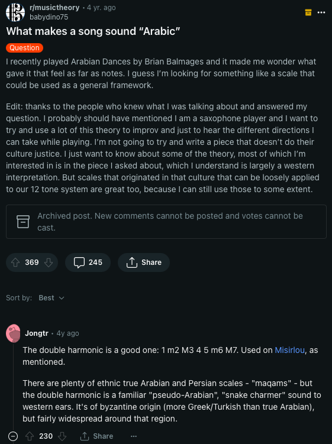
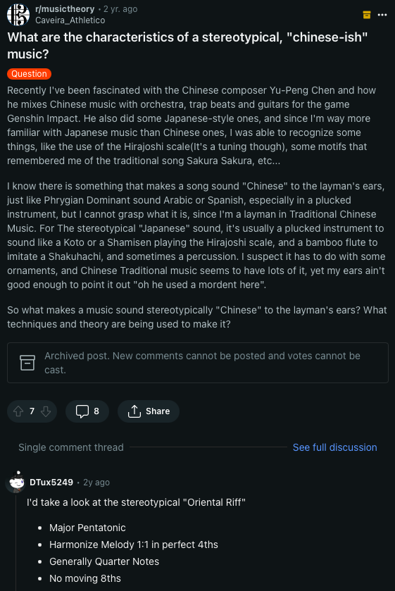

<link rel="stylesheet" href="custom.css">

<h1 class="r-fit-text">Layers of Meaning</h1>

<h2 class="r-fit-text">Teaching Instrumentation and Texture</h2>

Megan Lavengood

University of Maryland, February 2, 2024

--

## [Bibliography](https://www.zotero.org/mlavengood/collections/TJALUVK7/item-list)

---

<!-- [sufjan slide] -->

---

* Music theory as an area of research has become much more broad and inclusive.
* But without resources, it's difficult to reflect this in the classrom.

---

## Common critiques of theory and aural skills <!-- .element: class="r-fit-text" -->

1.	Theory classes should discuss more than just classical music. 
2.	Theory classes spend too much time on form and (especially) pitch.
3.	Theory classes alienate our students, and function as weeder classes that are gatekeeping certain people from studying music in an academic setting, to the detriment of our departments and our field.

--

Some published critique of typical undergraduate theory curriculum (look in [bibliography](https://www.zotero.org/mlavengood/collections/TJALUVK7/item-list) for more info)

* [Campbell et al. 2014](http://www.mtosmt.org/issues/mto.16.22.1/manifesto.pdf)
* [Kajikawa 2019](https://doi.org/10.2307/j.ctvcwp0hd) 
* [Ewell 2020](https://mtosmt.org/issues/mto.20.26.2/mto.20.26.2.ewell.html)

--

[Loren Kajikawa “The Possessive Investment in Classical Music:  Confronting Legacies of White Supremacy in U.S. Schools and Departments of Music" (2019)](https://www.zotero.org/mlavengood/collections/TJALUVK7/item-list)

--

### Motivations

* Practical concerns about enrollment dips and budget
* Ethical concerns about imperialism and exclusion

--

[Robin Attas "The Many Paths of Decolonization: Exploring Colonizing and Decolonizing Analyses of  A Tribe Called Red’s ‘How I Feel'" 2022](https://www.zotero.org/mlavengood/collections/TJALUVK7/item-list)

[Dylan Robinson _Hungry Listening: Resonant Theory for Indigenous Sound Studies_ 2020](https://www.zotero.org/mlavengood/collections/TJALUVK7/item-list)

--

### What can we do?

* Appropriately circumscribe our work and recognize our positionality
* Learn how to look at music in new and more holistic ways

--

<!-- .slide: data-background-color="black" -->

--

---

## Talk outline

1. Define timbre’s multifaceted nature
2. Suggest how different facets of timbre analysis would fit into different parts of an undergraduate music major curriculum
3. Offer practical resources for incorporating timbre study into your own curricula, based on my own experience and expertise

---

## Five "Conceptions" of timbre <!-- .element: class="r-fit-text" -->

1. Timbre as sound-source identifcation
2. Acoustics of timbre
3. Perceived timbre
4. Timbre semantics
5. Polyphonic timbre

[Stephen McAdams, “‘What Is Timbre?’ vs. ‘What Can We Do with Timbre?’: Picking the Right Questions” (2018)](https://www.zotero.org/mlavengood/collections/TJALUVK7/item-list) <!-- .element: style="font-size: large;"-->

--

## Perceived timbre

* Music perception and cognition
* Cultural musicology

Both require particular modes of research and thinking that are not typically engaged in theory classes

--

## Acoustics

* Research uses software and hardware that may be inaccessible or difficult for many undergraduate students
* Better suited to music technology class

--

## Sound-source identification

* Great for fundamentals and aural skills; important basis for later work too
* Activity: identifying instruments by ear, with increasing precision and nuance

--

## Semantics

* Great for written theory classes
* Theory already spends a lot of time establishing vocabulary; this is a natural fit

--

## Polyphonic Timbre

* Analysis of texture
* Auditory stream analysis (ASA)

[McAdams, Goodchild, and Soden, “A Taxonomy of Orchestral Grouping Effects Derived from Principles of Auditory Perception” (2022)](https://www.zotero.org/mlavengood/collections/TJALUVK7/item-list) <!-- .element: style="font-size: medium;"-->

---

## Classroom resources <!-- .element: class="r-fit-text" -->

Traditional textbooks don't help much:

* **One (or one-half) chapter** on texture/timbre
	* Benward/Saker (“Texture and textural reduction”)
	* Laitz (“Triads, Seventh Chords, and Texture”)
	* Roig-Francoli (“The Rudiments of Harmony II: Labeling Chords. Musical Texture.”)

* **No chapters on texture/timbre**
	* Clendinning/Marvin
	* Aldwell/Schachter
	* Burstein/Straus
	* Kostka/Payne/Almèn

But Open Educational Resources (OER) do!

--

## Classroom resources <!-- .element: class="r-fit-text" -->

[Tim Chenette, *Foundations of Aural Skills*](https://uen.pressbooks.pub/auralskills/#toc-part-123)

<iframe data-src="https://uen.pressbooks.pub/auralskills/#toc-part-123" width="100%" height="400px"></iframe>

--

## Classroom resources <!-- .element: class="r-fit-text" -->

[ACTOR Network, Timbre and Orchestration Resource](https://timbreandorchestration.org/modules)

<iframe data-src="https://timbreandorchestration.org/modules" width="100%" height="400px"></iframe>

--

## Classroom resources <!-- .element: class="r-fit-text" -->

[Mark Gotham, *Open Music Theory* v. 2, Orchestration](https://viva.pressbooks.pub/openmusictheory/part/orchestration)

<iframe data-src="https://viva.pressbooks.pub/openmusictheory/part/orchestration/#content" width="100%" height="400px"></iframe>

--

## Classroom resources <!-- .element: class="r-fit-text" -->

[Megan Lavengood, chapter on texture in pop music](https://viva.pressbooks.pub/openmusictheory/chapter/texture-in-pop-music/)

<iframe data-src="https://viva.pressbooks.pub/openmusictheory/chapter/texture-in-pop-music/#content" width="100%" height="400px"></iframe>

(Chapters on auditory scene analysis and timbre vocabulary coming soon)<!-- .element: class="r-fit-text" -->

---

## Activities

---

## Bibliography <!-- .element: class="r-fit-text" -->

Butler, Mark J. 2006. _Unlocking the Groove: Rhythm, Meter, and Musical Design in Electronic Dance Music_. Bloomington: Indiana University Press.

Campbell, Patricia Shehan, David Myers, Ed Sarath, Juan Chattah, Lee Higgins, Victoria Lindsay Levine, David Rudge, and Timothy Rice. 2014. “Transforming Music Study from Its Foundations: A Manifesto for Progressive Change in the Undergraduate Preparation of Music Majors.” Report of the Task Force on the Undergraduate Music Major. The College Music Society. [http://www.mtosmt.org/issues/mto.16.22.1/manifesto.pdf](http://www.mtosmt.org/issues/mto.16.22.1/manifesto.pdf).

Chenette, Timothy. 2021. “What Are the Truly Aural Skills?” _Music Theory Online_ 27 (2). [https://mtosmt.org/issues/mto.21.27.2/mto.21.27.2.chenette.html](https://mtosmt.org/issues/mto.21.27.2/mto.21.27.2.chenette.html).

———. 2022. _Foundations of Aural Skills_. [https://uen.pressbooks.pub/auralskills/](https://uen.pressbooks.pub/auralskills/).

Dolan, Emily. 2013. _The Orchestral Revolution: Haydn and the Technologies of Timbre_. Cambridge ; New York: Cambridge University Press.

Ewell, Philip A. 2020. “Music Theory and the White Racial Frame.” _Music Theory Online_ 26 (2). [https://mtosmt.org/issues/mto.20.26.2/mto.20.26.2.ewell.html](https://mtosmt.org/issues/mto.20.26.2/mto.20.26.2.ewell.html).

Ferrer, Rafael. 2011. “Timbral Environments: An Ecological Approach to the Cognition of Timbre.” _Empirical Musicology Review_ 6 (2): 64–74. [https://doi.org/10.18061/1811/51213](https://doi.org/10.18061/1811/51213).

Gotham, Mark, Kyle Gullings, Chelsey Hamm, Bryn Hughes, Brian Jarvis, Megan Lavengood, and John Peterson. 2021. _Open Music Theory_. [https://viva.pressbooks.pub/openmusictheory/](https://viva.pressbooks.pub/openmusictheory/).

Heidemann, Kate. 2016. “A System for Describing Vocal Timbre in Popular Song.” _Music Theory Online_ 22 (1). [https://doi.org/10.30535/mto.22.1.2](https://doi.org/10.30535/mto.22.1.2).

Hisama, Ellie. 2018. “Considering Race and Ethnicity in the Music Theory Classroom.” In _Norton Guide to Teaching Music Theory_, edited by Rachel Lumsden and Jeffrey Swinkin, First Edition. New York: W. W. Norton & Company.

Jarvis, Brian Edward. 2022. “BriFormer.” 2022. [https://www.brianedwardjarvis.com/MusicTheoryWebApps/BriFormer/briformer.html](https://www.brianedwardjarvis.com/MusicTheoryWebApps/BriFormer/briformer.html).

Jarvis, Brian Edward, Megan L. Lavengood, and Evan Williams. 2022. “Auralayer.” 2022. [https://brianedwardjarvis.com/auralayer/auralayer.html](https://brianedwardjarvis.com/auralayer/auralayer.html).

Kajikawa, Loren. 2019. “The Possessive Investment in Classical Music: Confronting Legacies of White Supremacy in U.S. Schools and Departments of Music.” In _Seeing Race Again: Countering Colorblindness across the Disciplines_, edited by Kimberlé Williams Crenshaw, Luke Charles Harris, Daniel Martinez HoSang, and George Lipsitz. University of California Press. [https://doi.org/10.2307/j.ctvcwp0hd](https://doi.org/10.2307/j.ctvcwp0hd).

Lavengood, Megan L. 2020. “The Cultural Significance of Timbre Analysis: A Case Study in 1980s Pop Music, Texture, and Narrative.” _Music Theory Online_ 26 (3). [https://doi.org/10.30535/mto.26.3.3](https://doi.org/10.30535/mto.26.3.3).

———. 2021. “Timbre, Rhythm, and Texture within Music Theory’s White Racial Frame.” In _The Oxford Handbook of Electronic Dance Music_, edited by Luis-Manuel Garcia and Robin James. New York: Oxford University Press. [https://doi.org/10.1093/oxfordhb/9780190093723.013.17](https://doi.org/10.1093/oxfordhb/9780190093723.013.17).

McAdams, Stephen. 2018. “‘What Is Timbre?’ Vs. ‘What Can We Do with Timbre?’: Picking the Right Questions.” Opening address presented at the Timbre is a Many-Splendored Thing, Montreal, July 4. [https://www.mcgill.ca/timbre2018/program](https://www.mcgill.ca/timbre2018/program).

———. 2019. “Timbre as a Structuring Force in Music.” In _Timbre: Acoustics, Perception, and Cognition_, edited by Kai Siedenburg, Charalampos Saitis, Stephen McAdams, Arthur N. Popper, and Richard R. Fay, 69:211–43. Springer Handbook of Auditory Research. Cham: Springer International Publishing. [https://doi.org/10.1007/978-3-030-14832-4\_8](https://doi.org/10.1007/978-3-030-14832-4_8).

McAdams, Stephen, Meghan Goodchild, and Kit Soden. 2022. “A Taxonomy of Orchestral Grouping Effects Derived from Principles of Auditory Perception.” _Music Theory Online_ 28 (3). [https://mtosmt.org/issues/mto.22.28.3/mto.22.28.3.mcadams.html](https://mtosmt.org/issues/mto.22.28.3/mto.22.28.3.mcadams.html).

Moore, Allan F. 2012. _Song Means: Analysing and Interpreting Recorded Popular Song_. Burlington, VT: Ashgate.

Newsome, Gregory Lee. n.d. “Orcheil.” Accessed August 28, 2023. [http://orcheil.ca/](http://orcheil.ca/).

Sandell, Gregory J. 1998. “Macrotimbre: Contribution of Attack, Steady State, and Verbal Attributes.” _The Journal of the Acoustical Society of America_ 103 (5\_Supplement): 2966. [https://doi.org/10.1121/1.422371](https://doi.org/10.1121/1.422371).

Siedenburg, Kai, and Stephen McAdams. 2017. “Four Distinctions for the Auditory ‘Wastebasket’ of Timbre.” _Frontiers in Psychology_ 8. [https://www.frontiersin.org/articles/10.3389/fpsyg.2017.01747](https://www.frontiersin.org/articles/10.3389/fpsyg.2017.01747).

Siedenburg, Kai, Charalampos Saitis, and Stephen McAdams. 2019. “The Present, Past, and Future of Timbre Research.” In _Timbre: Acoustics, Perception, and Cognition_, edited by Kai Siedenburg, Charalampos Saitis, Stephen McAdams, Arthur N. Popper, and Richard R. Fay, 1–19. Springer Handbook of Auditory Research. Cham: Springer International Publishing. [https://doi.org/10.1007/978-3-030-14832-4\_1](https://doi.org/10.1007/978-3-030-14832-4_1).

